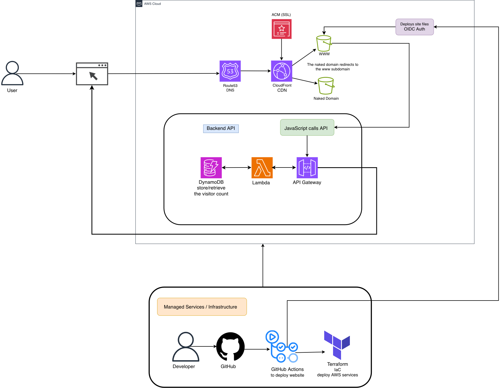

 # Cloud Resume Challenge – Frontend & Content Implementation

This repository contains the frontend portion of my Cloud Resume Challenge. I’m using the [Hugo](https://gohugo.io) static site generator with the **Blowfish*-theme to host:

- My resume (HTML + CSS version)
- A publications section (via a custom Hugo shortcode)
- Space for a future technical blog

In the next phase, this site will be deployed to AWS (S3, CloudFront, etc.) as part of the full Cloud Resume architecture.

------

## 1. Architecture Overview

This project implements a **static personal resume site*-using:

-**Hugo*-with the **Blowfish*-theme for the main site
-A separate **static HTML + CSS*-resume page for precise layout control

At a high level, the frontend architecture includes:

-A Hugo site with the standard directory structure:

  -`content/`, `layouts/`, `assets/`, `static/`, `themes/`
-The **Blowfish*-theme added as a Git submodule and used for:

  -The homepage and overall site framing
  -A future technical blog
-A **static resume*-at `/resume/` implemented as its own HTML file
-A **publications*-section implemented with a custom Hugo `pub` shortcode
-A shared **macro photograph of sand*-used as a visual motif across the site, via:

  -Hugo’s asset pipeline (for the Blowfish theme)
  -Direct CSS references (for the static resume and publication pages)

The goal is to keep the frontend simple and explicit so the next phase—deploying to AWS with a visitor counter—can focus on cloud infrastructure instead of refactoring the UI.

---

## 2. Implementation Details

### 2.1 Hugo Site and Theme

I’m using **Hugo*-as the static site generator.

-Standard Hugo structure:

  -`content/` – Markdown content
  -`layouts/` – custom templates and shortcodes
  -`assets/` – pipeline-managed assets
  -`static/` – pass-through static files
  -`themes/` – Hugo themes (including Blowfish)
-The **Blowfish*-theme is added as a Git submodule under `themes/blowfish`.
-The Hugo configuration:

  -Selects Blowfish as the active theme
  -Sets up the homepage
  -Defines a publications page
  -Leaves room for a future technical blog section

Blowfish gives me clean defaults and accessibility out of the box, so I can focus on the resume, publications, and later the AWS deployment.

### 2.2 Content Structure

The content is organized around three main areas:

-**Homepage and general site content**

  -Managed via standard Hugo Markdown files in `content/`
  -Uses Blowfish layouts for structure and styling

-**Publications page**

  -Implemented as a Hugo content page
  -Uses a custom Hugo shortcode (`pub`) for each publication entry
  -Keeps the Markdown readable while enforcing consistent HTML structure

-**Future technical blog**

  -A section is reserved for blog posts
  -Blowfish already provides layouts and styling
  -Posts can be added later without changing the core structure

### 2.3 Publications Shortcode (`pub`)

To keep the publications page easy to maintain while still rendering consistently, I created a custom `pub` shortcode.

-**File:*-`layouts/shortcodes/pub.html`
-**Purpose:**

  -Wrap each publication entry in a consistent HTML structure
  -Allow inline Markdown formatting (bold, italics, etc.) inside the citation

**Invocation pattern (in content):**

```hugo

```

**Internal behavior (simplified):**

-Reads the first positional parameter as the full citation string:

  -Authors, title, journal, year, and URL all in one line

-Uses Hugo’s `RenderString` on the citation so Markdown formatting is processed:

  -I can bold my name
  -Titles can be italicized

**Why this approach:**

-Each publication entry stays on a single line in the Markdown file
-The shortcode keeps the HTML consistent
-I still get flexible Markdown formatting for authors and titles

### 2.4 Static Resume Page

The resume is implemented as a **static HTML + CSS*-page instead of a Hugo template.

-**Location:**

  -`static/resume/index.html` – main resume page
  -`static/css/resume.css` – styles for the resume

-**Layout:**

  -Inspired by a Yale-style resume layout
  -Clear sections for:

    -Contact information
    -Summary
    -Experience
    -Education
    -Skills
    -Certifications
  -Two-column style for:

    -Job title / organization on the left
    -Dates and locations aligned on the right
  -Bulleted lists for responsibilities and achievements
  -Uses semantic HTML for readability and accessibility

I chose a static HTML file here because it gives more precise control over alignment, spacing, and bullets without fighting Markdown quirks.

---

## 3. Design and Style

### 3.1 Background Imagery

The site uses a **macro photograph of sand*-(taken on my phone) as a unifying visual element.

-In the Hugo/Blowfish side of the site:

  -The sand image lives under `assets/`
  -It’s integrated via Hugo’s asset pipeline and theme styling
-On the static resume page:

  -The same image is stored under `static/img/`
  -It’s applied directly via CSS in `static/css/resume.css`

This keeps the homepage, publications page, and resume page visually connected, even though they’re rendered in slightly different ways.

### 3.2 Visual Consistency

Even though the homepage and resume are built differently (Hugo + theme vs static HTML), I aimed for a cohesive experience:

-Shared sand background image
-Similar typography and spacing
-Content-forward layout with minimal distractions

The resume should feel like part of the same site, not a separate microsite.

### 3.3 CSS and Layout Choices

For the resume:

-I use **minimal, framework-free CSS*-to:

  -Keep the styles small and easy to understand
  -Avoid external CSS frameworks (no Tailwind, no Bootstrap)
-The CSS handles:

  -Alignment of roles vs dates/locations
  -Section spacing and headings
  -Applying the background image consistently

### 3.4 Icons and External Assets

For social/profile icons (GitHub, LinkedIn, etc.), I use the [Phosphor Icons](https://phosphoricons.com/) library via its webfont/CDN. This lets me:

-Use simple class names in HTML
-Avoid managing individual SVG files in the repo

---

## 4. Key Files

Some of the most important files in this repo:

-`static/resume/index.html`
  Standalone HTML implementation of the resume page, served at `/resume/`.

-`static/css/resume.css`
  Stylesheet for the resume page, including layout, typography, and background image.

-`static/img/sand-hero-background.jpg`
  Background image used directly by the static resume via CSS.

-`assets/img/sand-hero-background.jpg`
  The same sand image, used by the Blowfish theme through Hugo’s asset pipeline.

-`layouts/shortcodes/pub.html`
  Hugo `pub` shortcode that renders individual publication entries with Markdown formatting support.

-`layouts/_default/publications.html`
  Custom layout for the publications page that wraps content using the `pub` shortcode and integrates it into the main site layout.

-Icon library: [Phosphor Icons](https://phosphoricons.com/)
  Used via CDN/webfont for social and other UI icons.

---

## 5. AI Assistance

I used **ChatGPT 5.1*-to speed up parts of the frontend work, but I kept control over the architecture and final implementation.

### 5.1 What AI Helped With

AI was used for:

-**HTML/CSS conversion for the resume**

  -Converting a description of a Yale-style resume layout into an initial HTML/CSS structure for `static/resume/index.html` and `static/css/resume.css`

-**Shortcode development**

  -Drafting and refining the Hugo `pub` shortcode in `layouts/shortcodes/pub.html`

-**Publication layout**

  -Drafting the initial publication layout in `layouts/_default/publications.html`

-**Debugging and integration**

  -Figuring out correct placement of shortcode files in `layouts/`
  -Understanding how `RenderString` behaves with Markdown
  -Resolving minor rendering issues related to the shortcode

-**CSS refinement**

  -Generating minimal, framework-free styles for the resume layout

### 5.2 What I Did Myself

I remained responsible for:

-**Architecture and design decisions**

  -Choosing Hugo and the Blowfish theme
  -Deciding to use a static HTML resume instead of a Hugo template
  -Designing the publications flow with a shortcode

-**Code review and integration**

  -Reviewing and editing AI-generated HTML/CSS and Hugo templates
  -Making sure everything fits the project structure
  -Cleaning up code for readability and maintainability

-**Content and assets**

  -Writing all resume content
  -Writing the publication entries and citations
  -Taking the macro sand photograph and integrating it into both Hugo and static CSS

All AI suggestions were tested locally and only committed once they matched the behavior and design I wanted.

### 5.3 Core Prompt Used for Resume Conversion

The bootcamp requires documenting the core prompts used for AI assistance. Here is one of the main prompts I used for converting the resume layout:

<details>
<summary>Prompt for resume HTML/CSS conversion</summary>

I'm building a personal resume page for my Cloud Resume Challenge using Hugo and the Blowfish theme.

I have a resume layout based on the Yale resume template. Please convert that layout into semantic HTML and CSS that
I can use as a standalone page inside Hugo's static folder.

Requirements:

1. Output plain HTML and a separate CSS file.
2. Do NOT use any CSS frameworks (no Bootstrap, Tailwind, etc.).
3. Use the least amount of CSS selectors needed to get a clean, readable layout.
4. The HTML should be structured like a professional resume:

   -Name and contact info at the top
   -Summary section
   -Experience (with job title, organization, location, and dates)
   -Education
   -Skills
   -Certifications
5. Make sure the dates and locations can be aligned on the right side while titles and organizations stay on the left.
6. Use class names that are easy to understand (e.g., .resume-card, .resume-section, .resume-item, .item-meta).
7. Assume the page will live at /resume/ and that the CSS file will be available at /css/resume.css.

Return:

-One HTML snippet that I can paste into static/resume/index.html.
-One CSS snippet for resume.css.

</details>

Related artifacts:

- [Yale-resume-template-image](Yale-Experience-Alum-Resume.png)
- [Yale-resume-template HTML output](Yale-resume-template.html)
- [Overall-CSS output](/docs/resume-template.css)

### 5.4 Core Prompt Used for the `pub` Shortcode

The original conversation around the `pub` shortcode was informal (e.g., “Make it a Hugo shortcode so I don’t repeat HTML”). For documentation, this is the reconstructed version of the key request:

#### Prompt for pub shortcode
```text
I have a publications section on my Hugo site and I want to render each publication entry in a consistent way without repeating HTML.

Context:
- The site uses Hugo and the Blowfish theme.
- I have a list of publications written in Markdown on a publications page.
- Each publication includes: authors, title, journal, year, and a link to the open access article.
- I’d like the link to the article to be clearly visible, ideally styled like a button similar to the screenshot I’ve attached (but we must not copy any external code or layout exactly).

Requirements:
1. Propose a Hugo approach that avoids duplicating HTML for each publication entry.
2. Implement this as a Hugo shortcode (for example, called `pub`) that:
   - Wraps the inner Markdown content in a suitable container element.
   - Uses `RenderString` so I can:
     - Bold my own name in the author list.
     - Italicize the publication title.
     - Use standard Markdown links for the article URL.
3. Show an example of how the shortcode would be used inside a Markdown content file for the publications page.
4. Keep the HTML structure simple and generic enough that I can style it later with CSS (including giving the link a “button-like” appearance).

Please:
- Provide the full contents of the shortcode file (`layouts/shortcodes/pub.html`).
- Provide a sample Markdown snippet that shows how I would write one publication entry using this shortcode.
- Do not include any JavaScript.
- Do not copy any external site’s markup; use a simple, clean structure that I can customize.
```

Related artifacts:

- [ChatGPT publication shortcode](pub-shortcode.html)
- [ChatGPT publication layout](publications-layout.html)


If there are additional detailed prompts (for shortcode tweaks, debugging, etc.), they can be collected in a separate file such as `docs/ai-prompts.md` and linked from here.


## 6. Lessons and Design Decisions

This section captures the main decisions and trade-offs I made while building the frontend.

### 6.1 Static HTML Resume vs Hugo Template

**Decision**
Use a static HTML + CSS page at `static/resume/index.html` instead of a Hugo template.

**Why:**

-The resume layout needs tight control over:

  -Alignment of dates and locations
  -Bullet indentation and spacing
  -Section ordering and spacing
-Hugo’s Markdown rendering can get in the way for this style of layout
-A standalone HTML file is explicit, easy to tweak, and doesn’t depend on template logic

**Future:**
If I ever want deeper integration with Hugo (for data files, partials, etc.), I could refactor the resume into a Hugo layout later.

### 6.2 Background Image in Both `assets/` and `static/`

**Decision**
Store the sand background image twice:

- assets/img/sand-hero-background.jpg – used by Hugo/Blowfish
- static/img/sand-hero-background.jpg – used directly by the static resume

**Why:**

-Blowfish uses Hugo’s asset pipeline for theme images
-The static HTML resume can’t call `resources.Get`, so it needs a plain static path
-Duplicating the image keeps both sides straightforward and decoupled

**Future:**
If the resume is converted to a Hugo template, I could remove the `static/` copy and rely only on the asset pipeline.

### 6.3 Minimal CSS Instead of Frameworks

**Decision**
Avoid external CSS frameworks for the resume.

**Why:**

- The layout is relatively simple
- A framework would add:

  - Extra complexity in class names
  - Extra assets and build steps
- Custom CSS is:

  - Easy to scan
  - Focused on this layout only

### 6.4 Publications Layout Inspiration

The publications section (grouped citations, highlighted author name, italicized titles, and “open article” links) follows a pattern similar to academic CV and lab websites. I used that general idea, then:

- Designed my own HTML structure
- Implemented it with a Hugo `pub` shortcode
- Kept the content readable in Markdown while rendering consistently in the browser

All markup in this repo was written specifically for this project.


## 7. AWS Deployment Architecture

### 7.1 Infrastructure Overview

The site is deployed on AWS using a production-grade infrastructure that emphasizes security, performance, and automation.


**Core Services:**

- **Amazon S3** – Private buckets for static content storage
- **Amazon CloudFront** – Global CDN with edge caching and HTTPS
- **AWS Certificate Manager** – SSL/TLS certificates for custom domain
- **Amazon Route 53** – DNS management and domain routing
- **CloudFront Functions** – Request transformation for Hugo directory routing
- **GitHub Actions** – CI/CD pipeline with OIDC authentication
- **Terraform** – Infrastructure as Code for reproducible deployments

### 7.2 Domain Architecture

The site uses a dual-domain setup that follows AWS best practices:

**Primary Domain**
- S3 bucket: `www` – stores actual Hugo site content
- CloudFront distribution with Origin Access Control (OAC)
- HTTPS enforced via ACM certificate
- CloudFront Function for directory index routing

**Root Domain **
- S3 bucket: `exampledemo.dev` – configured for redirect
- Separate CloudFront distribution
- Redirects all traffic to www subdomain

**Why this architecture?**

Storing content on the www subdomain instead of the naked domain prevents cookie scope inheritance issues. Cookies set on a naked domain automatically propagate to ALL subdomains, which would create unnecessary overhead and potential security issues for future additions like `api.exampledemo.dev` or `blog.exampledemo.dev`.

### 7.3 Security Implementation

**Private S3 Buckets**
- All public access blocked at bucket level
- Content only accessible via CloudFront
- Direct S3 URLs return "Access Denied"

**Origin Access Control (OAC)**
- CloudFront authenticates to S3 using AWS service principal
- S3 bucket policy explicitly allows only the specific CloudFront distribution
- Modern replacement for legacy Origin Access Identity (OAI)

**HTTPS Everywhere**
- ACM certificate covers both lahdigital.dev and *.lahdigital.dev
- Certificate must be in us-east-1 region (CloudFront requirement)
- TLS 1.2 minimum protocol version
- Automatic redirect from HTTP to HTTPS

**IAM Best Practices**
- GitHub Actions uses OIDC (no long-lived access keys)
- Temporary credentials issued per deployment
- Least-privilege IAM policies for deployment role

### 7.4 CloudFront Function for Hugo Routing

**The Problem:**

When using CloudFront with OAC to access S3, directory URLs like `/publications/` don't automatically resolve to `/publications/index.html`. This happens because CloudFront with OAC uses the S3 bucket endpoint (which doesn't understand directory indexes) rather than the S3 website endpoint (which requires public bucket access).

**The Solution:**

A CloudFront Function rewrites incoming requests before they reach S3:

```javascript
function handler(event) {
    var request = event.request;
    var uri = request.uri;
    
    // If URI ends with '/', append 'index.html'
    if (uri.endsWith('/')) {
        request.uri += 'index.html';
    }
    // If URI doesn't have a file extension, assume it's a directory
    else if (!uri.includes('.')) {
        request.uri += '/index.html';
    }
    
    return request;
}
```

**Benefits:**
- Executes at edge locations (sub-millisecond latency)
- Maintains security with private S3 buckets
- No Lambda@Edge complexity or cost
- Works seamlessly with Hugo's directory structure

### 7.5 Infrastructure as Code (Terraform)

**Why Terraform Instead of CloudFormation:**

The bootcamp instructor used Ansible and CloudFormation, but I chose Terraform for its cloud-agnostic approach. The skills and patterns learned with Terraform translate directly to GCP, Azure, and other providers, making it a more valuable long-term investment.

**Terraform Structure:**

```
terraform/
├── main.tf           # Provider configuration
├── variables.tf      # Variable definitions
├── terraform.tfvars  # Actual values (not committed)
├── s3.tf            # S3 bucket resources
├── cloudfront.tf    # CloudFront distributions
├── route53.tf       # DNS records
└── outputs.tf       # Resource identifiers
```

**Key Terraform Resources:**

- `aws_s3_bucket` – Both www and root domain buckets
- `aws_s3_bucket_public_access_block` – Enforce private buckets
- `aws_s3_bucket_policy` – Allow CloudFront OAC access
- `aws_s3_bucket_website_configuration` – Root domain redirect
- `aws_cloudfront_origin_access_control` – Secure S3 access
- `aws_cloudfront_distribution` – Both www and redirect distributions
- `aws_route53_record` – A records aliasing to CloudFront

**Deployment Workflow:**

```bash
terraform init      # Initialize providers
terraform plan      # Preview changes
terraform apply     # Deploy infrastructure
terraform destroy   # Tear down (for testing)
```

Testing reproducibility was crucial: `terraform destroy` followed by `terraform apply` proves the entire infrastructure can be rebuilt from code.

### 7.6 CI/CD with GitHub Actions

**Pipeline Architecture:**

The deployment pipeline uses GitHub Actions with OIDC authentication to AWS, eliminating the need for long-lived access keys.

**Workflow Jobs:**

1. **Build Job**
   - Installs Hugo CLI (extended version for Blowfish theme)
   - Checks out repository with submodules
   - Builds site with production settings
   - Uploads build artifact

2. **Deploy Job**
   - Downloads build artifact
   - Authenticates to AWS via OIDC
   - Syncs content to S3 with `--delete` flag
   - Invalidates CloudFront cache

**OIDC Authentication Setup:**

1. Created GitHub OIDC identity provider in AWS IAM
2. Created IAM role with trust policy allowing GitHub Actions
3. Added inline policies for S3 sync and CloudFront invalidation
4. Configured GitHub Actions with `id-token: write` permission

**Security Benefits:**
- No AWS access keys stored in GitHub
- Temporary credentials expire automatically
- Role assumption scoped to specific repository and branch
- Follows AWS IAM best practices

**Workflow File:** `.github/workflows/deploy.yml`

**Trigger:** Every push to main branch

**Result:** Site updates automatically within 2-3 minutes

### 7.6 Manual AWS Configuration Process

Before implementing Terraform, I manually configured all AWS services to understand each component:

**Configuration Order:**

1. **Route 53** – Created hosted zone, updated registrar nameservers
2. **ACM** – Requested certificate in us-east-1, validated via DNS
3. **S3** – Created buckets, configured public access blocks
4. **CloudFront** – Created distributions with OAC, attached certificates
5. **Route 53** – Added A records aliasing to CloudFront distributions
6. **CloudFront Functions** – Created and associated rewrite function

This manual-first approach ensured I understood what each Terraform resource would create before automating it.

---

## 8. Deployment and Testing

### 8.1 Local Development

```bash
# Start Hugo development server
hugo server -D

# Build production site
hugo --minify --baseURL domain
```

### 8.2 Manual Deployment (before CI/CD)

```bash
# Build site
hugo

# Sync to S3
aws s3 sync ./public s3://www.exampledemo.dev --delete

# Invalidate CloudFront cache
aws cloudfront create-invalidation \
  --distribution-id 
  --paths "/*"
```

### 8.3 Automated Deployment (current)

```bash
# Make changes to content or code
git add .
git commit -m "Update resume"
git push origin main

# GitHub Actions automatically:
# 1. Builds Hugo site
# 2. Syncs to S3
# 3. Invalidates CloudFront cache
```

### 8.4 Testing Checklist
Checked to make sure each page of site loaded properly and that naked domain redirects 
to www. 
---

## 9. CloudFront

### 9.1 CloudFront Caching Strategy

**Cache Invalidation:**
Triggered automatically on deployment via GitHub Actions. Invalidates all paths (`/*`) to ensure changes appear immediately.

---

## 10. Visitor Counter Backend



*Diagram created with draw.io*

### 10.1 Components

**DynamoDB**
- Stores visitor count with atomic updates
- Single table design for simplicity

**Lambda Function**
- Python runtime
- GET endpoint returns current visitor count
- Increments count on each request

**API Gateway (HTTP V2)**
- Lightweight HTTP API (not REST API)
- Connected to custom subdomain

### 10.2 Implementation Journey

**What Worked Smoothly**
- Lambda deployment via Terraform
- DynamoDB table provisioning
- Initial API Gateway setup with AWS-generated URL
- Tested successfully using curl commands

**Challenge: Custom Domain Integration**

Connecting my domain to the API via subdomain proved more difficult than expected. After consulting multiple AI tools and Stack Overflow, the solution wasn't immediately obvious.

**The Issue:** API Gateway requires a service-linked role to map custom domains, and my Terraform user lacked admin privileges to create it automatically.

**The Solution:**

1. Ensure AWS CLI is installed on your machine

2. Run the following command (as administrator):

   ```bash
   aws iam create-service-linked-role \
     --aws-service-name ops.apigateway.amazonaws.com \
     --profile YourProfileName
   ```

3. This creates the API Gateway service-linked role managed by AWS, enabling custom domain mapping

**Why This Matters:** If you're using a non-admin IAM user for Terraform (which is a security best practice), you'll likely encounter this same issue when attempting custom domain configuration.

### 10.3 Lessons Learned

1. **HTTP API vs REST API**: API Gateway HTTP V2 is simpler and more cost-effective for basic use cases
2. **Service-Linked Roles**: Some AWS services require these special roles that can't always be created through Terraform with limited permissions
3. **Non-Admin Terraform Users**: Running Terraform with least-privilege IAM users is good practice but requires manual setup of certain AWS-managed resources
---

## 11. Key Learnings

### 11.1 Infrastructure as Code Benefits

- **Reproducibility:** Entire infrastructure can be rebuilt from code
- **Version Control:** Infrastructure changes tracked in Git
- **Documentation:** Terraform files serve as living documentation
- **Testing:** Can destroy and recreate infrastructure to verify

### 11.2 Security First Approach

- Private S3 buckets with OAC > public buckets
- OIDC authentication > long-lived access keys
- HTTPS everywhere with modern TLS versions
- Least-privilege IAM policies

### 11.3 Manual Configuration Before Automation

Configuring AWS services manually first before writing Terraform was invaluable:
- Understood what each resource does
- Knew correct configuration values
- Could troubleshoot Terraform issues
- Appreciated automation benefits

---

## 12. Resources and References

### 12.1 Documentation Used

- [Hugo Documentation](https://gohugo.io/documentation/)
- [Blowfish Theme Docs](https://blowfish.page/)
- [AWS CloudFront Documentation](https://docs.aws.amazon.com/cloudfront/)
- [Terraform AWS Provider](https://registry.terraform.io/providers/hashicorp/aws/latest/docs)
- [GitHub Actions OIDC](https://docs.github.com/en/actions/deployment/security-hardening-your-deployments/configuring-openid-connect-in-amazon-web-services)

### 12.2 Tools Used

- **Hugo** v0.139.0 (extended)
- **Terraform** v1.9+
- **AWS CLI** v2
- **Git** for version control
- **VS Code** for development

---

## 13. Backend Visitor Counter

### 13.1 Frontend Visitor Counter Display

The visitor counter is now fully implemented with a JavaScript frontend that connects to the AWS backend.

**Implementation:**
- JavaScript file at `assets/js/view-counter.js` handles API communication
- Loaded via Hugo's `extend-footer.html` partial using the asset pipeline
- Counter displayed on homepage in `content/_index.md`
- Environment-aware: uses mock API locally, real API in production

**Throttling Strategy:**
- **Client-side:** localStorage tracks daily visits—each visitor counted once per day
- **Server-side:** API Gateway throttling (10 req/sec, 20 burst) configured via Terraform

**Local Development Setup:**
- Mock API using json-server: `json-server --watch db.json --port 3001`
- `db.json` structure: `{ "counter": { "count": 0 } }`
- Two terminals: one for Hugo (`hugo server`), one for mock API

**What I Learned:**
- **Mock APIs are simple:** json-server let me validate frontend JavaScript in minutes without building a backend
- **Hugo themes have their own patterns:** Blowfish uses `extend-footer.html` for custom scripts, not `customScripts` in config
- **Environment switching:** The ternary pattern `window.location.hostname === "localhost" ? localURL : prodURL` cleanly handles dev vs production
- **Throttling layers:** Client-side localStorage prevents redundant API calls; API Gateway throttling protects against abuse

## 14. Blog

### 14.1 Blog Section**
- Created first blog post: "Hello World" - a simple introduction to the blog
- Implemented page bundle structure (`content/posts/Hello-Internet/index.md`)
- Configured custom background image for posts list page using `_index.md`
- Customized posts list layout:
  - Changed heading from "Posts" to "Blog" 
  - Added custom hero background image (`/img/sand-hero-background.jpeg`)
  - Disabled heading anchors on list page for cleaner appearance
  - Set `heroStyle = "background"` in params.toml for full-width hero images
- Each blog post uses featured images displayed as background heroes
- Blog architecture ready for future technical content and cloud learning documentation

